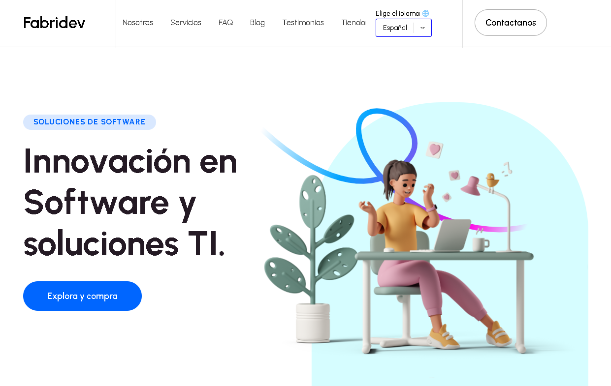

# FabriDev Software Solutions - Landing page

Una landing page diseñada para destacar y promocionar servicios, productos o ideas de manera profesional y atractiva.

---

## 🚀 Características

- **Diseño moderno y responsivo**: Optimizado para dispositivos móviles y de escritorio.
- **Carga rápida**: Implementación de optimizaciones para mejorar la experiencia del usuario.
- **Secciones clave**: Información clara y directa sobre los servicios ofrecidos.
- **Imágenes redondeadas**: Visualización personalizada.
- **Estilo manejable**: Utiliza clases dinámicas de Tailwind CSS.

---

## 🛠️ Tecnologías utilizadas

- **Next.js**: Framework para React que permite renderizado estático y dinámico.
- **Tailwind CSS**: Framework CSS para diseño rápido y consistente.
- **TypeScript** *(opcional)*: Tipado seguro para mayor robustez.
- **i18n** *(opcional)*: Soporte multilenguaje.
- **Vercel**: Hospedaje y despliegue.

---

## 🌟 Vista previa

  
*Describe qué aparece en la captura.*

---

## Licencia

Este proyecto está bajo la licencia MIT. Consulta el archivo [LICENSE](LICENSE.txt) para más detalles.

---

## Contacto

Si tienes alguna pregunta o sugerencia, no dudes en contactarme a través de [fabriziobarrios92@gmail.com](mailto:fabriziobarrios92@gmail.com).
- **Autor**: Fabrizio Barrios Saavedra.
- **Portafolio**: [Mi Portafolio](https://portafolio-fabridev.vercel.app).
- **Mi Landing Page**: [FabriDev](https://fabridev.vercel.app/es)

---

## Desarrollador

<h3><b>Aplicación Desarrollada por:</b> Fabrizio Barrios Saavedra (<a href="https://portafolio-fabridev.vercel.app" target="_blank">RFBS23</a> - <a href="https://fabridev.vercel.app/es" target="_blank">FabriDev</a>)</h3>

---